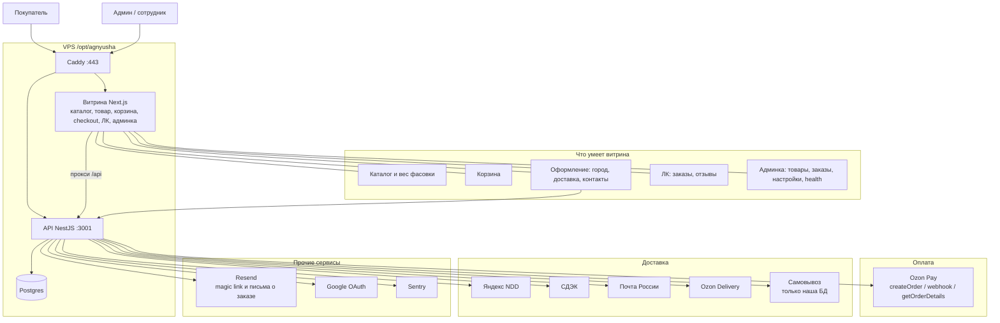

# Как работает сайт Агнюша

Покупатель и админ открывают витрину. Caddy принимает HTTPS и отдаёт сайт (Next.js) и API (NestJS). Витрина ходит в API. Секреты живут в `.env` на VPS, не в образе.

Заказ, оплата и доставка — [order-delivery-payment.md](./order-delivery-payment.md). Опрос статусов перевозчиков — [delivery-status-polling.md](./delivery-status-polling.md).

## Кто откуда берёт конфиг

| Что | Откуда на VPS |
|---|---|
| Домен, URL, тарифы, `YANDEX_PLATFORM_STATION_ID`, id способов отгрузки | `deploy/.env.example` при деплое |
| Пароли и токены: Postgres, Google, Resend, СДЭК, Яндекс, Почта, Ozon Pay, Ozon Delivery, Sentry | GitHub Secrets |
| Локальный `.env.production` и корневой `.env.example` | На сервер не едут |
