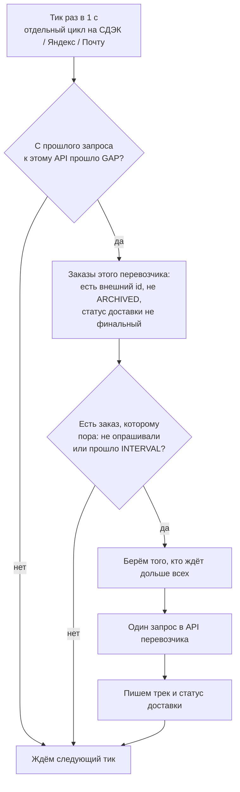

# Опрос статусов доставки (СДЭК, Яндекс, Почта)

Фоновый опрос нужен, чтобы узнавать статус отправления **без захода покупателя в личный кабинет**. Позже на смене статуса можно будет слать уведомление «товар пришёл».

Ozon Delivery в этот опрос не входит. Самовывоз — тоже: у него нет внешнего API.

Параллельно остаётся опрос **при открытии** списка заказов в ЛК и админке (TTL 3 минуты). Это только чтобы сразу показать свежий статус человеку на сайте.

## Два независимых рычага

У каждого перевозчика свои переменные. СДЭК не делит очередь с Яндексом, Яндекс — с Почтой.

| Переменная | Смысл | По умолчанию |
|---|---|---|
| `CDEK_POLL_INTERVAL_MIN` | Как часто **один заказ** этого перевозчика можно спросить снова | 60 |
| `CDEK_POLL_GAP_MS` | Минимальная пауза **между запросами к этому API** | 2500 |
| `YANDEX_POLL_INTERVAL_MIN` / `YANDEX_POLL_GAP_MS` | То же для Яндекса | 60 / 2500 |
| `POCHTA_POLL_INTERVAL_MIN` / `POCHTA_POLL_GAP_MS` | То же для Почты России | 60 / 2500 |

`INTERVAL=0` выключает фон для этого перевозчика.

Ключи API должны быть заданы, иначе воркер этого перевозчика молчит (`skipped` в health).

## Как выбирается следующий заказ

Раз в секунду у каждого перевозчика свой тик. Тики идут **параллельно**: в одну секунду могут уйти максимум три запроса — по одному в СДЭК, Яндекс и Почту.

Для выбранного перевозчика:

1. Если предыдущий запрос к **этому** API ещё не закончился — выход.
2. Если с прошлого запроса к этому API не прошло `GAP` — выход.
3. Взять активные отгрузки: есть внешний id, заказ не `ARCHIVED`, код доставки не финальный (`DELIVERED`, `REMOVED`, отмена и т.п.).
4. Из них — те, кого ещё не опрашивали, либо с последнего опроса прошло `INTERVAL`.
5. Из «пора» берётся тот, кто ждёт **дольше всех** (никогда не опрашивали — первые).
6. Один запрос. Записываются трек, код и текст статуса перевозчика. Статус заказа на сайте (`Отправлен` / `Завершён`) пока не меняется.
7. Если перевозчик ответил «вручено / отменено» — заказ выпадает из очереди. Если заявки больше нет (`404`: СДЭК, Яндекс `customer_order_not_found`, Почта) — опрос стоп, код `REMOVED`, заказ в `ARCHIVED` (кроме уже `DONE` / `CANCELLED`).

Новый заказ не ждёт конца часа: у него нет `deliveryStatusAt`, он сразу «пора», но встаёт в хвост за `GAP`, а не пачкой.



Пример на 3 заказах Яндекса, интервал 60 минут, пауза 3 секунды:

```
12:00:00  A — ещё не поллили → запрос
12:00:03  B
12:00:06  C
12:00:09  никому не прошло 60 минут → тишина
12:20:00  появился D → сразу следующий слот
13:00:00  A снова пора
```

100 заказов при паузе 2.5 с займут первую «волну» примерно на 4 минуты, затем тишина до истечения интервала у самых ранних.

Если активных заказов больше, чем `INTERVAL / GAP`, за час всех не опросить. Health покажет деградацию «не укладывается в интервал».

## Что умеет каждый API

| Перевозчик | Метод | Что видно |
|---|---|---|
| СДЭК | `GET /orders/{uuid}` | Принят, в пути, в ПВЗ, вручен |
| Яндекс | `GET /api/b2b/platform/request/info` | Текущий статус заявки |
| Почта | Otpravka `shipment` / `backlog` | Пока только «новый» / «в партии». Вручение по треку этим API не видно |

Почта для письма «пришёл» позже потребует Tracking API. Схема опроса уже общая.

## Health

В карточках СДЭК, Яндекс и Почта на `/admin/health` к пингу ключей добавляется строка опроса: размер очереди, время последнего успешного запроса, интервал и пауза.

`degraded`, если:

- очередь не успевает за интервал при заданной паузе;
- или при ненулевой очереди последний успех старше двух интервалов;
- или ещё не было успеха, но уже есть ошибка опроса.

Пинг OAuth и опрос — разные вещи: ключи могут быть живы, а воркер — нет.

## Тесты

В `NODE_ENV=test` фоновый таймер **не стартует**, чтобы интеграционные тесты не били моки сами. Опрос при открытии ЛК в тестах как был.
