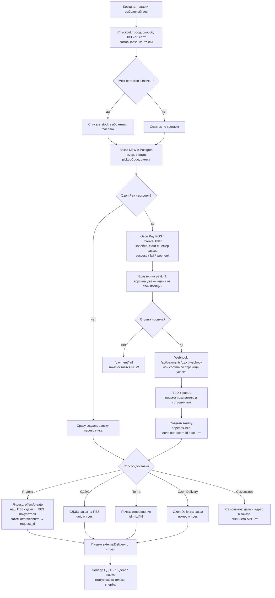

# Заказ, доставка и оплата

Покупатель собирает корзину и оформляет заказ. Деньги идут через Ozon Pay. Заявка перевозчику создаётся **после** оплаты. Если Ozon Pay не настроен, заявка создаётся сразу, а статус оплаты не выставляется.

Общая карта сервисов — [how-the-site-works.md](./how-the-site-works.md). Дальше статусы отправления читает поллер — [delivery-status-polling.md](./delivery-status-polling.md).

Самовывоз и оплата не мешают друг другу: при включённом Ozon Pay заказ тоже ждёт `PAID`, но заявку никуда не отправляет. Ozon Delivery в создании заявки есть, на витрине метод обычно последний и недоступен для выбора.

## Яндекс после оплаты

Точка сдачи — `YANDEX_PLATFORM_STATION_ID` (ПВЗ, куда вы приносите посылку). ПВЗ покупателя — `pickupCode` из чекаута. В оффере `last_mile_policy = self_pickup`, оплата в биллинге `already_paid`.

Если `offers/create` или `confirm` упадут, заказ уже `PAID`. Ошибка остаётся в логе, внешний id пустой. Следующая пометка «оплачен» (повтор webhook или confirm) пробует создать заявку снова. То же для СДЭК, Почты и Ozon Delivery.

До оплаты заявка перевозчику не создаётся. Если создание платежа само упало, заказ `NEW` удаляется.

## Что видит покупатель

| Шаг | Статус заказа |
|---|---|
| Нажал «оформить», платёж создан | `NEW` |
| Закрыл оплату или Ozon вернул fail | `NEW`, ссылку можно открыть снова |
| Деньги прошли | `PAID` — «Собирается» |
| Перевозчик принял после сдачи | Передан в доставку → в пути → можно забирать → получен |
| Заявки у перевозчика больше нет | `ARCHIVED`, кроме уже полученного или отменённого |
